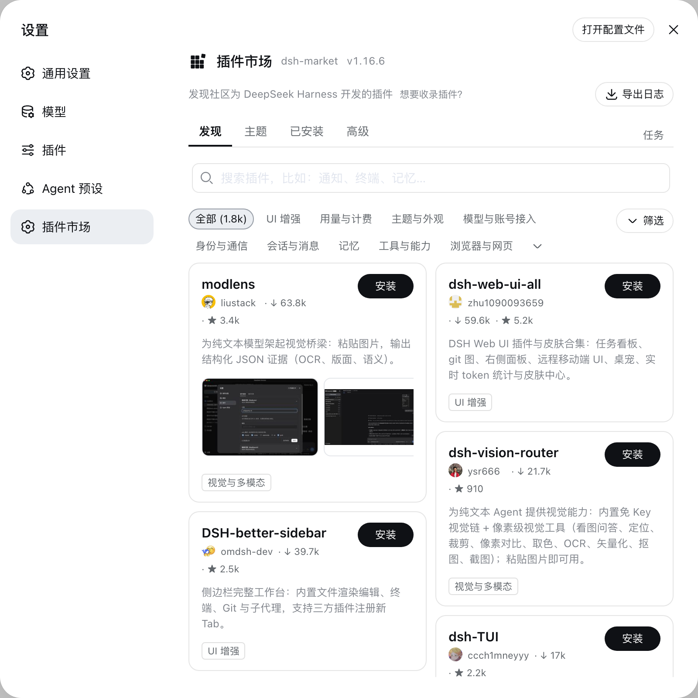

<p align="center">
  
</p>

# dsh-market

[English](README.md) | 中文

[](https://www.npmjs.com/package/dshmarket)
[](https://github.com/dsh-market/dsh-market)

> `dsh-market` 本身不依赖任何特定客户端，装在任意兼容 DeepSeek Harness 协议的宿主里都能用。我们正在与 `anywhere-labs/deepseek-harness-desktop` 沟通后续合作事宜，有进展会在这里同步。推荐使用已内嵌本插件市场的 [dsh-desktop](https://github.com/dataelement/dsh-desktop)、[deepseek-harness-desktop](https://github.com/hairyf/deepseek-harness-desktop)，以及其他优秀第三方客户端。

装在 DeepSeek Harness 里的插件市场。打开设置 → **插件市场** → 逛一逛，点一下，装好。



主题一键换：装完即生效，点一下切换，不用重启。

## 安装

```sh
dsh plugin --profile web add dshmarket
```

重启 `dsh web`，打开 **设置 → 插件市场**。

**需要 dsh web 0.1.0-rc.6 或更新版本。** 宿主太旧时市场会自我禁用，并在浏览器
控制台说明原因，而不是拿缺失的原语去渲染——如果设置里根本没出现「插件市场」这
一项，通常就是这个原因。桌面端要留意：它可能内置了比 `npm` 装到的更旧的 dsh（#139）。

## 你会得到

- **逛与搜**——完整社区目录（1550+ 插件，每天在涨），分类筛选、star 数、最热/最新排序，中英描述跟随界面语言
- **截图展示**——App Store 式截图，多图自动轮播，点开还能看大图；作者在 registry 里策展的截图列表卡片就直接显示（零额外请求），没有策展的插件则在打开安装弹窗时自动从 README 抽取；图片仅从 GitHub 图床加载
- **主题**——独立主题页：装完立即生效，点一下切换（主题互斥、选择跨重启保留），卸载即恢复
- **一键安装**——确认来源，实时进度；多数插件刷新页面即可用，无需重启
- **备份与恢复**——把 profile 的插件清单与配置导出为可读 JSON，换机导入，存到 WebDAV 并每日自动备份，或通过私有 GitHub Gist 跨机器同步；恢复采用**合并**方式（备份之后新装的插件会保留），写入前校验、失败自动回滚
- **更新**——逐插件检测（npm 版本或锁定 commit 对比 HEAD），一键更新或全部更新；市场自己也走同一通道升级
- **卸载**——两步确认防误触；本次会话装的插件即点即卸
- **热禁用 / 启用**——开关会往 profile 的 `cordis.patch.yml`（官方补丁层，机制移植自 [dsh-plugin-hub](https://github.com/Noob-stupid/dsh-plugin-hub)）写入 `- id: …` + `disabled: true|false`：DSH 的 HMR 约 1 秒内重新组合，无需重启，loader 每次启动都会重新应用这个选择；手工改过的补丁行会显示成徽标，宿主基础设施插件禁止开关，补丁文件格式不对时绝不会被写得更糟
- **按需重启**——无法热加载的变更会在待重启提示旁显示一键重启；操作仅接受本机同源请求
- **零术语**——缺组件（pnpm）时市场自己发现、一键自动装好，全程不见命令行
- **导出日志**——一键生成脱敏纯文本日志方便反馈（home 路径与密钥形状已打码；任何数据都不会被上传）。市场版本号就在标题旁边，截图反馈时自带版本信息
- **设置卡片**——dsh 0.1.0-rc.7 起，市场在 **设置 → 插件 → 插件配置** 里管理**它自己**，和其它插件并排：看当前版本、选择**更新通道**（稳定版，或 Beta 抢先试用还在验证中的版本——只影响市场自己，不影响你装的其它插件；打开开发者模式后还会多出「开发版」通道，直接取开发分支上的构建）、更新、或者移除市场。移除时可勾选一并清理——包括市场写进补丁层的停用行，被它关掉的插件会恢复运行，而不是保持停用却再没有界面能打开它们
- **诊断**——插件加载顺序与冲突一页看全：bundle 栈（官方/社区徽标）、重复的 loader 条目、依赖版本不一致、核心包多版本共存、覆盖项与非法配置条目。术语说人话，问题块高亮，全部可折叠
- **加载顺序**——拖拽调整社区 bundle 的顺序，或直接采用按插件自身 before/after 规则推导出的建议顺序。写入前先跑一次静态组合校验，通过才落盘；应用之前面板会告诉你这个顺序会改变什么（多少处覆盖、多少无效或重复条目）
- **AI 修复**——一键把诊断结果生成的修复 prompt（错误/警告/顺序冲突 + 保守的改动范围约束）复制到剪贴板，你粘进新对话，自己决定发不发

## 速度

只要插件发布了 npm 包（registry 会校验其 repository 指回同一仓库,防冒名）,安装即走 npm tarball 而非整仓 GitHub 下载——通常秒级;仅 GitHub 分发的插件取决于你到 GitHub 的网络。

## 安全

- 只允许安装 [awesome-dsh-plugin](https://awesome-dsh-plugin.com) 精选列表内的来源,其它一律拒绝
- 构建脚本默认禁止执行（pnpm ≥10）,放行与否由你按包显式决定
- 终端/命令行类插件装进网页版前会被明确提醒
- 安装接口只接受同源 POST;市场不会向任何地方上报数据
- 备份可能包含 profile 配置里的密钥——导出与上传前 UI 会明确提醒;WebDAV 同步仅限 https、拒绝内网地址,且密码永不落盘浏览器
- 重启接口还要求客户端直接来自环回地址（拒绝代理转发请求），并使用原入口、参数、环境和工作目录重新启动 DSH
- 一键重启会启动脱离终端的替代进程。**当本进程就是 systemd 服务的主进程时，按钮会自动隐藏**——否则市场重启会连带杀掉 cgroup 里的接管进程，服务起不来，待重启提示会说明原因。判定要求「systemd 标记」和「本进程是该 unit 的主进程」同时成立：`INVOCATION_ID` 会被 unit 的所有后代继承（包括普通终端），只看它会误伤一大批本来能正常重启的机器。pm2 和 launchd 不做检测，这类部署需要下面的显式配置。两种做法：在**设置 → 插件 → 插件配置**里关掉「允许重启」，或者写进 profile 补丁——注意必须嵌在 `config:` 下面，因为 loader 只把这个子对象传给插件，写在顶层会静默失效（#227，感谢 @Fantasymax）：

  ```yaml
  - id: dsh-market
    name: dshmarket
    config:
      allowRestart: false   # 不要和 `name:` 并排写在顶层
  ```

  生效后 `GET /dsh-market/status` 会返回 `"restart": false`。
- 从终端启动时，替代进程脱离原终端，关闭原终端后仍会继续运行
- 收录 ≠ 背书:插件是第三方代码,请只安装你信任的来源

## 提交你的插件

**这个仓库是市场应用本身，不是插件目录。** 市场里的插件列表来自精选列表 [awesome-dsh-plugin](https://github.com/awesome-dsh-plugin/awesome-dsh-plugin)——想让你的插件上架，请去**那边**提 PR（在列表里加一条即可，站点和本市场会自动收录，通常一天内生效）。请不要往本仓库提插件条目。

## 路线图与反馈

- **Bug** 提 [issue](https://github.com/dsh-market/dsh-market/issues)，附上市场页面的「导出日志」能让排查快十倍
- **功能建议**放 [Roadmap](https://github.com/orgs/dsh-market/projects/1)。issues 只留「坏掉的东西」，所以提成 issue 的建议会被移到那边并关闭；讨论仍留在你写的地方
- 路线图上的每一项都欢迎社区 PR——动手前在对应条目里说一声，免得两个人重复造

## 数据源

每次打开都实时请求 [awesome-dsh-plugin.com/plugins.json](https://awesome-dsh-plugin.com/plugins.json)——精选条目、npm 映射、star 数由 CI 每日刷新，不使用过期缓存兜底；连不上时会给出具体原因和耗时，并提供「重试」按钮。

刻意不做本地快照兜底：目录每天都在增长，过期的答案不是「差一点」而是「错的」——今早刚发布的插件会显示成「不存在」。

**如果你的网络访问不了这个域名**，可以改指到镜像：在 dsh 运行的环境里设置 `DSHM_REGISTRY_URL`，指向任何提供相同 `plugins.json` 结构的地址：

```sh
DSHM_REGISTRY_URL=https://your-mirror.example/plugins.json dsh web
```

## 友情链接

### DSH Desktop（dataelement）

[dsh-desktop](https://github.com/dataelement/dsh-desktop)——DeepSeek Harness 桌面客户端：无需自装 Node.js 即可运行和管理本地 Harness，并默认预置本插件市场。[dshdesktop.com](https://dshdesktop.com)

### DeepSeek Harness Desktop（hairyf）

[deepseek-harness-desktop](https://github.com/hairyf/deepseek-harness-desktop)——基于 **Tauri**（Rust + Web）构建的 DeepSeek Harness 原生桌面客户端：一键本地安装并启动，无需自装 Node.js；首次启动可选择安装本插件市场作为推荐插件。

### DSH Get

[DSH Get](https://www.dshget.com/)——DeepSeek Harness 插件的网页检索目录：分类筛选、中英描述、安装命令与插件详情页；其规范化的目录快照公开在 [bobby-sheng/dshget-data](https://github.com/bobby-sheng/dshget-data)。

### modlens

[modlens](https://github.com/liustack/modlens)——全网第一个 DeepSeek Harness 视觉插件，为 DeepSeek、GLM 等纯文本模型外挂视觉能力，粘贴图片即得结构化 JSON 证据（OCR、版面、语义）。本市场内即可直接安装：

```sh
dsh plugin --profile web add @liustack/modlens
```

## 许可

MIT · [dshmarket.com](https://dshmarket.com)
